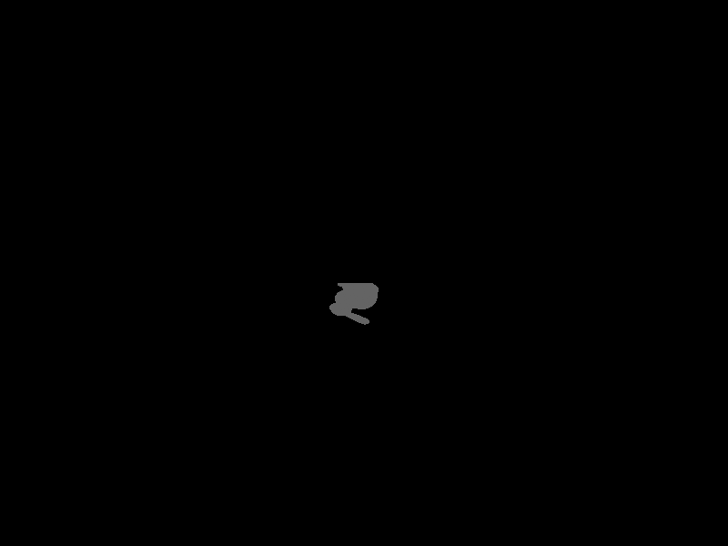
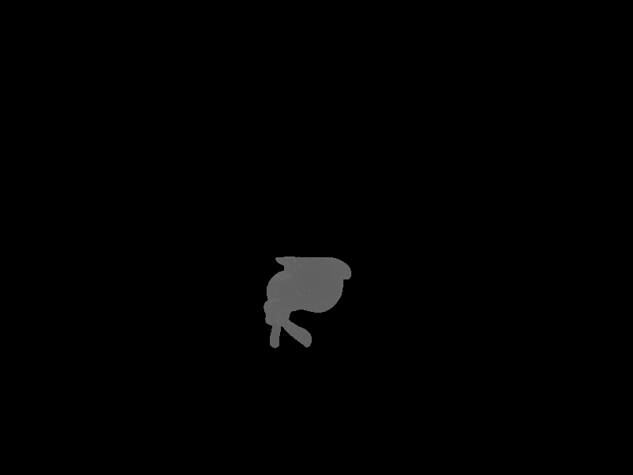

## 总览

## 踩坑

1. Eigen3.3.3 "Assertion failed: (internal::UIntPtr(array) & (15)) == 0

   该问题似乎来自于溢出，将模式由x86改为64后消失。
   
2. 兔子在xy平面上的投影只有很少的几个`fragment`能显示，经测试，是加速包围盒边界设置[+1-1]有问题。原先用的三角形点与点之间差距很大，因此该bug没有体现，当使用模型时，每个三角形都非常小，点与点的差距在1之内，于是使得包围盒未能将三角形包含。

## 记录

1. 引入新的库 `OBJ_Loader`，来加载模型。
2. 模型矩阵，暂只支持绕y轴旋转
3. 摄像机矩阵，根据摄像机位置和方向变换
4. 投影矩阵，根据视域、角度和远近平面来制作投影矩阵
   该矩阵有Bug未修复，当使用该矩阵时，会使模型消失不可见。
5. 在main中引入全局常亮PI=3.1415926
6. 引入根据重心坐标做插值的三个`static interpolate`，分别计算float，Vector3f和Vector2f插值。
7. depth、color和normal都会根据重心坐标做插值。

## 成果

## 分析

不知道为什么，模型依旧是反的，希望能解决这个问题。

当使用投影矩阵时模型的投影会不见，希望解决这个问题。

后续解决：原因是摄像机位置过于靠前，物体在摄像机和近平面之间，不在可视范围内。
（可以想象当摄像机过于接近某个物体导致穿过其表面使得透明）

