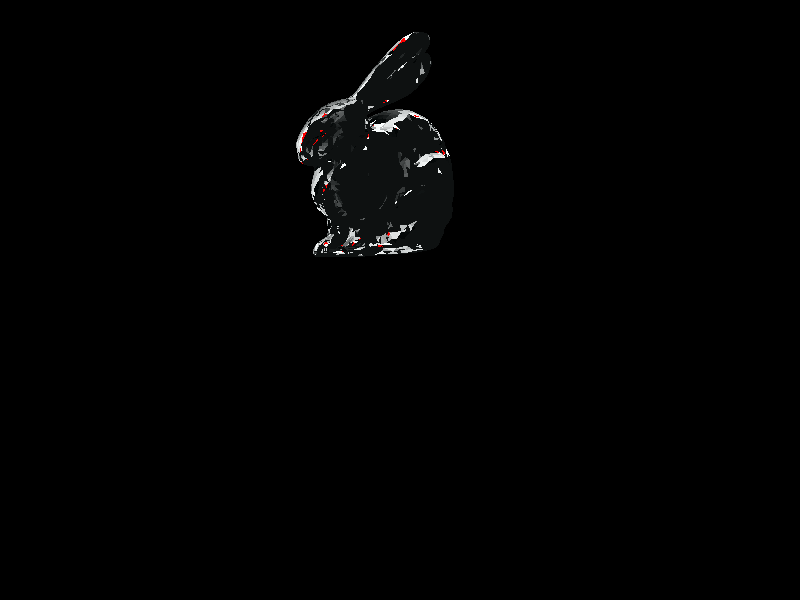
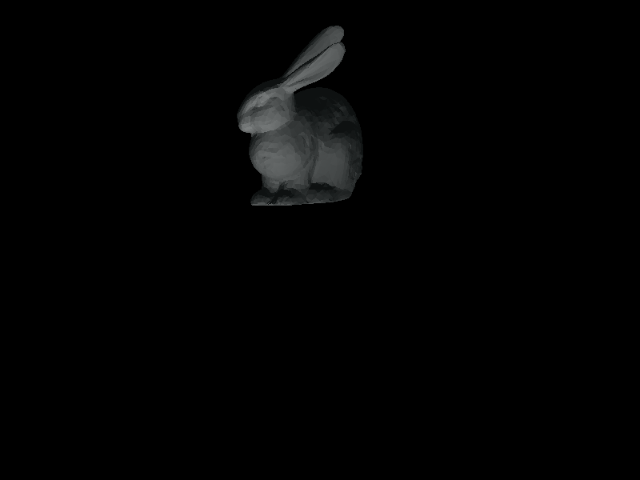
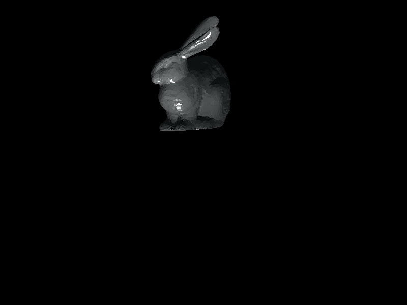

## 今日目标

此前得到的是纯色图，因为没有做渲染，今天希望为其添加BlingPhong光照渲染。

暂时不设置多光源，将光源的信息在BlingPhong渲染器中固定。

## 光照分析

首先需要三个光照系数

1. 物体对环境光的反射系数 ka
2. 纹理颜色kd（漫反射）
3. 镜面反射系数ks

然后是光照的信息

1. 环境光强Ia
2. 光源光强Id
3. 光源位置
4. 光照方向
5. 镜面反射衰减系数P

需要传入的三角形（图元信息）

1. 法向量
2. 三个顶点
3. 颜色-->纹理颜色Kd

依次计算环境光、漫反射和镜面反射相加。

## 踩坑

1. 光源与渲染点距离过万，经检查，问题出自投影矩阵，发现某处参数填错，已修改。
2. 物体表面颜色超过1.0f，颜色出现斑点红色，应当做防溢出处理。
3. 降低了光源的光强后问题得到改善。

### 物体颠倒问题

因为这条内容较多，故单独分出来仔细记录。

出于规范，摄像机总是位于原点，看向-z方向。但是原先的课程源码中，`camera`矩阵只做了位移变换，而没有做旋转变换。

而默认载入的模型坐标都位于[0,1]的空间中，也就是在`+z`方向上。于是课程源码选择令摄像机看向+z方向，将远近平面也都转为正数。由此，坐标系变成了非左手也非右手的另类坐标系。

想象右手坐标系，然后沿着x轴逆时针选择，直到中指指尖对准自己(相当于逆转了z轴)，可以注意到此时，食指(y轴)指向了下方，于是，上下颠倒了。

为了解决这一问题，只需要为摄像机矩阵添加视角旋转矩阵，再设定其看向`+z`方向即可。

```c++
Eigen::Matrix4f get_cameraMatrix(Eigen::Vector3f viewpos, Eigen::Vector3f look_dir, Eigen::Vector3f look_up)
{
	Eigen::Vector3f w = -look_dir.normalized();
	Eigen::Vector3f u = look_up.cross(w);
	u.normalize();
	Eigen::Vector3f v = w.cross(u);
	Eigen::Matrix4f view, translate;
	view << 
		u.x(), u.y(), u.z(), 0.0f,
		v.x(), v.y(), v.z(), 0.0f,
		w.x(), w.y(), w.z(), 0.0f,
		0.0f , 0.0f , 0.0f , 1.0f;
	translate <<
		1.0f, 0.0f, 0.0f, -viewpos.x(),
		0.0f, 1.0f, 0.0f, -viewpos.y(),
		0.0f, 0.0f, 1.0f, -viewpos.z(),
		0.0f, 0.0f, 0.0f, 1.0f;
	return view * translate;
}
r.set_camera(get_cameraMatrix(Eigen::Vector3f(0.0f,0.0f,-1.0f), Eigen::Vector3f(0.0f,0.0f,1.0f), Eigen::Vector3f(0.0f, 1.0f, 0.0f)));
```


## 成果

### 坑1

因为错误距离过大，导致漫反射贡献几乎为0，得到的是纯粹的环境光

与前日渲染的结果几乎无差，但是修正了上下颠倒的问题。

### 坑2

修改距离后得到的环境光与漫反射叠加，但是由于溢出问题导致渲染结果奇怪。



### 正确的漫反射

降低光强后得到的正确图。



### 加上镜面反射

