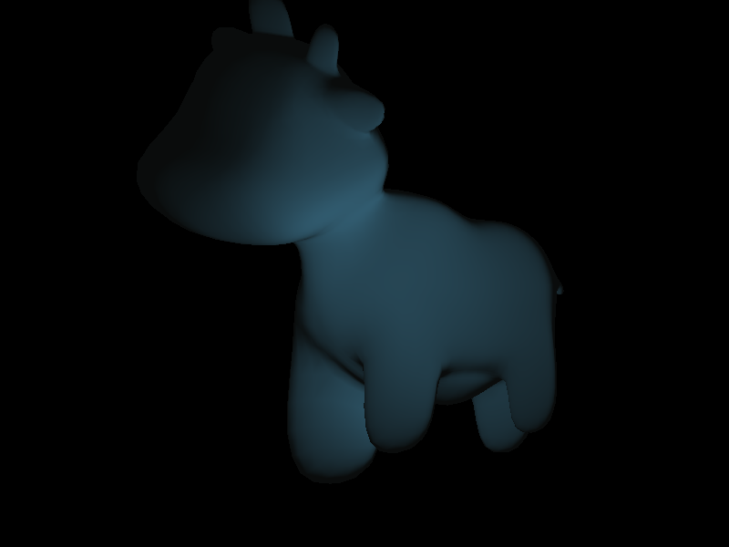
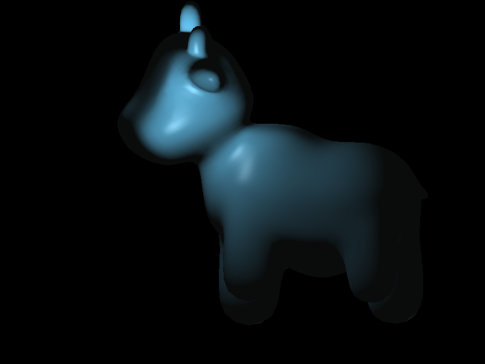
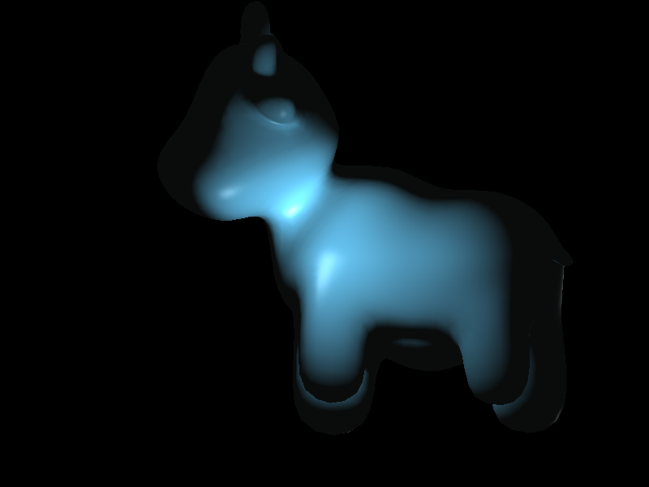
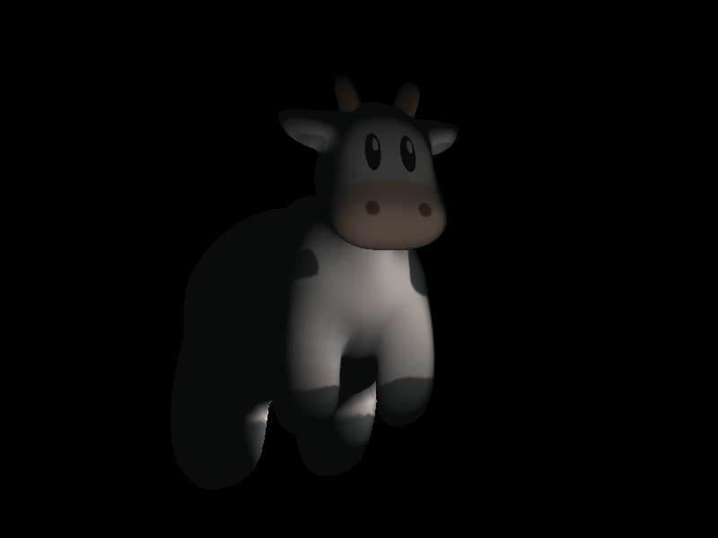

## 总览

昨天完成了blingPhong光照模型，但是实现非常原始，封装性很差。

通过直接传入三角形和固定光源进行渲染。

今天欲将渲染的单位从三角形改为`fragment_shader_payload`，其包含以下信息

1. 片元在透视变换前的位置--三角形时由三点进行插值
2. 片元的颜色--插值
3. 片元的法向量--插值
4. 片元的纹理坐标--插值
5. 片元的纹理--指向某一纹理的指针(亨元模式)

同时再提供一个顶点着色单位`vertex_shader_payload`

当前它只包含顶点信息

1. position 原始未变换的位置

修正了插值的一些东西，使得结果更加准确，具体改了什么都忘记了。





## 纹理载入

stb_images不能重复载入...解决方法是丢到cpp文件中，而不是头文件。

尽管写了纹理渲染器，但是由于uv坐标不正确，始终得不到正确的值。

## 镜面反射修正

原先发现一个问题，就是镜面反射虽然存在，但是不明显，或者说根本是有问题的。仔细观察上面的图，发现这种镜面反射根本就是错误的！

早上醒来时思考问题，忽然想到，我做cos计算时用的是反射方向和法向量，实际上应该是反射方向和摄像机的入射方向。

额外传入摄像机位置后计算仍然结果不甚理想，于是我注意到渲染点(view_pos或者说ori_pos)的位置是经过MVP(MCP)转换的，那么摄像机坐标也需要转换。

将摄像机坐标变换后结果仍然不甚理想，于是我又注意到光源的位置同样需要MVP变换。

这次之后，终于得到了理想的结果。



## 纹理问题

此前一直得不到正确的纹理坐标，后发现是索引没有乘rgb通道数3

> int index = (y * texture_p->w + x)*3;

之后依旧尽管纹理贴图可以正确放到模型上了，但是纹理的坐标有问题，然后想到:

取重心坐标的时候，用的是以左上角为原点的坐标系，而uv坐标系应当是以左下角为原点。

```c++
Eigen::Vector3f getColorFromTexture(std::shared_ptr<Texture> texture_p, Eigen::Vector2f uv)
{
	float r, g, b;
	int x = texture_p->w * uv.x();
	int y = texture_p->h * uv.y();
	int index = (y * texture_p->w + x)*3;
	r = texture_p->data[index+0];
	g = texture_p->data[index+1];
	b = texture_p->data[index+2];
	return Eigen::Vector3f(r,g,b);
}
```


这是原先的uv sample，通过修正y轴后得到正确的uv坐标

```c++
Eigen::Vector3f getColorFromTexture(std::shared_ptr<Texture> texture_p, Eigen::Vector2f uv)
{
	float r, g, b;
	int x = texture_p->w * uv.x();
	int y = texture_p->h * (1- uv.y());
	int index = (y * texture_p->w + x)*3;
	r = texture_p->data[index+0];
	g = texture_p->data[index+1];
	b = texture_p->data[index+2];
	return Eigen::Vector3f(r,g,b);
}
```

